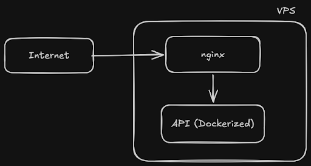

# Laporan Penugasan Modul 1 Open Recruitment NETICS 2026

|Nama|NRP|
|---|---|
|Muhammad Quthbi Danish Abqori|5025241036|

## Informasi Deployment
- **URL API (Endpoint `/health`):** `http://20.194.40.78/health`
- **Docker Image (GHCR):** `ghcr.io/ch-tato/oprecnetics-modul-1:latest`

---

## Rencana Implementasi dan Pengerjaan

Pengerjaan modul CI/CD ini saya bagi menjadi 5 tahap utama yang dieksekusi secara berurutan untuk memastikan setiap komponen berfungsi dengan baik sebelum diotomatisasi.

### Tahap 1: Persiapan Infrastruktur (VPS & Repository)
Langkah pertama yang dilakukan adalah menyiapkan server (*Virtual Private Server*) publik. Saya menggunakan layanan Microsoft Azure (Azure for Students) untuk melakukan *provisioning* Virtual Machine (VM). 
- **OS:** Ubuntu Server 24.04 LTS
- **Size:** Standard_B1s (1 vCPU, 1 GiB memory)
- **Networking:** Membuka port SSH (22), HTTP (80), dan HTTPS (443).
- **Security:** Menggunakan autentikasi *SSH public key* dengan mengunduh file `.pem` untuk akses *remote*.


### Tahap 2: Pengembangan API (Go)
Setelah infrastruktur siap, saya beralih ke *local environment* untuk membuat API sederhana menggunakan bahasa pemrograman **Go (Golang)**. Pemilihan versi Golang dan struktur kodenya didasarkan pada rekomendasi *best-practice* dari ChatGPT terkait bahasa ini [5]. API ini memiliki satu endpoint `/health` yang mengembalikan data JSON berisi nama, NRP, status server, timestamp, dan uptime.

Berikut adalah file `main.go`:
```go
package main

import (
	"encoding/json"
	"log"
	"net/http"
	"time"
)

var startTime time.Time

type HealthResponse struct {
	Nama      string `json:"nama"`
	NRP       string `json:"nrp"`
	Status    string `json:"status"`
	Timestamp string `json:"timestamp"`
	Uptime    string `json:"uptime"`
}

func healthHandler(w http.ResponseWriter, r *http.Request) {
	if r.Method != http.MethodGet {
		http.Error(w, "Method not allowed", http.StatusMethodNotAllowed)
		return
	}

	w.Header().Set("Content-Type", "application/json")

	response := HealthResponse{
		Nama:      "Muhammad Quthbi Danish Abqori",
		NRP:       "5025241036",
		Status:    "UP",
		Timestamp: time.Now().Format(time.RFC3339),
		Uptime:    time.Since(startTime).String(),
	}

	if err := json.NewEncoder(w).Encode(response); err != nil {
		http.Error(w, err.Error(), http.StatusInternalServerError)
	}
}

func main() {
	startTime = time.Now()

	http.HandleFunc("/health", healthHandler)

	port := ":8080"
	log.Printf("API Server is running on port %s...", port)

	if err := http.ListenAndServe(port, nil); err != nil {
		log.Fatal("Failed running the server: ", err)
	}
}
```


### Tahap 3: Dockerisasi API (Containerization)
Untuk memastikan aplikasi dapat berjalan konsisten di lingkungan apapun, API dibungkus ke dalam *container* Docker. Pemahaman dasar terkait pembuatan Dockerfile, Image, dan Container saya pelajari melalui referensi video tutorial Docker [2] serta modul *deployment* NETICS [4].

Dalam pembuatan `Dockerfile`, saya menggunakan teknik **Multi-stage builds** [7] untuk memisahkan proses kompilasi (*builder*) dengan lingkungan *runtime*. Pada tahap *build*, saya merujuk pada dokumentasi resmi Docker untuk image Golang [3] dan menggunakan *base image* Alpine versi terbaru [1]. Saya juga secara spesifik menonaktifkan CGO (`CGO_ENABLED=0`) agar *binary* Go yang dihasilkan bersifat statis dan dapat berjalan di OS yang sangat minimalis [6]. Di tahap *run*, *container* mengekspos port `8080`, memenuhi syarat penugasan untuk tidak menjalankan API di port 80 ataupun 443.

Berikut adalah file `Dockerfile`:
```Dockerfile
# build stage
FROM golang:1.26-alpine AS builder
WORKDIR /usr/src/app
COPY go.mod ./
COPY . .
RUN CGO_ENABLED=0 GOOS=linux go build -o main .

# run stage
FROM alpine:latest
WORKDIR /root/
COPY --from=builder /usr/src/app/main .
EXPOSE 8080
CMD ["./main"]
```


### Tahap 4: Infrastructure as Code (Ansible) & Konfigurasi Nginx
Proses instalasi dependensi dan konfigurasi server diotomatisasi menggunakan **Ansible**. Saya menyusun struktur *playbook* dan *inventory* berdasarkan panduan dasar modul Ansible NETICS [8][9]. 

Dalam menyusun file *inventory*, saya menggunakan metode pembacaan file `.pem` agar Ansible dapat mengakses VPS Azure secara aman [10]. File `setup.yml` dibuat untuk menjalankan *tasks* instalasi *packages* menggunakan modul `apt` [14] dan memastikan *services* berjalan menggunakan modul `systemd` [15].



Selain itu, Ansible bertugas meletakkan file konfigurasi **Nginx** ke dalam VPS. Nginx dikonfigurasi sebagai *Reverse Proxy* [12] yang mendengarkan port 80 dan meng-*forward* *traffic* ke `localhost:8080` (port container API). Pemahaman dasar sintaks Nginx didapat dari dokumentasi resminya [11], yang kemudian saya improvisasi dengan menambahkan fitur *timeout*, *logging*, dan spesifikasi HTTP versi 1.1 berdasarkan *best practice* sistem *production* [13].

Berikut adalah file `ansible/inventory.ini`:
```ini
[vps]
20.194.40.78

[vps:vars]
ansible_user=lixyon
ansible_ssh_private_key_file=~/.ssh/netics-vps_key.pem
```

Berikut adalah file `ansible/nginx.conf`:
```conf
server {
    listen 80;
    server_name _;

    location / {
        proxy_pass http://localhost:8080;
        proxy_set_header Host $host;
        proxy_set_header X-Real-IP $remote_addr;
        proxy_set_header X-Forwarded-For $proxy_add_x_forwarded_for;
        
        proxy_connect_timeout 60s;
        proxy_send_timeout 60s;
        proxy_read_timeout 60s;

        proxy_http_version 1.1;
    }
    access_log /var/log/nginx/access.log;
    error_log /var/log/nginx/error.log warn;
}
``` 

Berikut adalah file `ansible/setup.yml`:
```yml
---
- name: Setup VPS for NETICS CI/CD
  hosts: vps
  become: yes

  tasks:
    - name: Update apt cache
      apt:
        update_cache: yes
        cache_valid_time: 3600

    - name: Install Docker and Nginx
      apt:
        name:
          - docker.io
          - nginx
        state: present
    
    - name: Ensure Docker service is running and enabled
      systemd:
        name: docker
        state: started
        enabled: yes

    - name: Add lixyon user to docker group
      user:
        name: lixyon
        groups: docker
        append: yes
    
    - name: Copy nginx config
      copy:
        src: nginx.conf
        dest: /etc/nginx/sites-available/default
      notify: Restart nginx

    - name: Ensure nginx is running and enabled
      systemd:
        name: nginx
        state: started
        enabled: yes

  handlers:
    - name: Restart nginx
      systemd:
        name: nginx
        state: restarted
``` 


### Tahap 5: Otomasi CI/CD (GitHub Actions)
Tahap terakhir adalah membangun *pipeline* otomatisasi untuk *Continuous Integration* dan *Continuous Deployment* (*CI/CD*). Pemahaman mengenai struktur dasar *workflow*, eksekusi *jobs*, dan *steps* didapat dari referensi sintaks resmi GitHub [18] serta video pengenalan CI/CD [17] dan modul Github yang diberikan NETICS sendiri [16].


File `.github/workflows/deploy.yml` dirancang menggunakan variabel kontekstual GitHub (`${{ ... }}`) [20] dan terdiri dari dua tugas utama yaitu sebagai berikut.
1. **Build and Push Image:** Mengunduh repositori menggunakan `actions/checkout` [23], *login* ke GitHub Container Registry (GHCR) menggunakan `docker/login-action` [22], lalu mem-*build* dan mendorong *image* menggunakan `docker/build-push-action` [24]. Penyimpanan *image* dilakukan di GHCR karena integrasinya yang *seamless* dengan GitHub [19].
2. **Deploy via SSH:** Menggunakan `appleboy/ssh-action` [21] untuk melakukan *remote* ke VPS Azure, menarik *image* terbaru dari GHCR, menghentikan *container* lama, dan menjalankan *container* baru. Seluruh alur *pipeline* ini juga telah melalui proses *review* dan improvisasi terkait *caching* dan manajemen tag *image* dari diskusi *best practice* ChatGPT [25].

Berikut adalah file `.github/workflows/deploy.yml`:
```yml
name: CI/CD Pipeline NETICS

on:
  push:
    branches:
      - main

env:
  REGISTRY: ghcr.io
  IMAGE_NAME: ${{ github.repository }}
  FORCE_JAVASCRIPT_ACTIONS_TO_NODE24: true

jobs:
  build-and-push:
    name: Build and Push Docker Image
    runs-on: ubuntu-latest
    permissions:
      contents: read
      packages: write

    steps:
      - name: Checkout repository
        uses: actions/checkout@v4
      
      - name: Set up Docker Buildx
        uses: docker/setup-buildx-action@v3

      - name: Log in to the Container registry
        uses: docker/login-action@v3
        with:
          registry: ${{ env.REGISTRY }}
          username: ${{ github.actor }}
          password: ${{ secrets.GITHUB_TOKEN }}

      - name: Build and push Docker image
        uses: docker/build-push-action@v5
        with:
          context: .
          push: true
          pull: true
          tags: |
            ${{ env.REGISTRY }}/${{ env.IMAGE_NAME }}:latest
            ${{ env.REGISTRY }}/${{ env.IMAGE_NAME }}:${{ github.sha }}
          cache-from: type=gha
          cache-to: type=gha,mode=max
  
  deploy:
    name: Deploy to Azure VPS
    needs: build-and-push
    runs-on: ubuntu-latest

    steps:
      - name: Execute deployment via SSH
        uses: appleboy/ssh-action@v1.0.3
        with:
          host: ${{ secrets.VPS_IP }}
          username: ${{ secrets.VPS_USERNAME }}
          key: ${{ secrets.VPS_SSH_KEY }}
          script: |
            echo "${{ secrets.GITHUB_TOKEN }}" | docker login ${{ env.REGISTRY }} -u ${{ github.actor }} --password-stdin
            docker pull ${{ env.REGISTRY }}/${{ env.IMAGE_NAME }}:${{ github.sha }}
            docker stop netics-api-container || true
            docker rm netics-api-container || true
            docker run -d -p 8080:8080 --name netics-api-container --restart unless-stopped ${{ env.REGISTRY }}/${{ env.IMAGE_NAME }}:${{ github.sha }}
            docker image prune -f

```


---

## Kendala yang Dihadapi dan Solusi

Selama pengerjaan, terdapat beberapa kendala teknis yang berhasil diselesaikan melalui proses *troubleshooting* dan *debugging* (yang beberapa dilakukan menggunakan ChatGPT):

1. **Kendala Permission File `.pem`**
   
   Saat mencoba SSH ke VPS Azure, muncul *error* "UNPROTECTED PRIVATE KEY FILE!". Hal ini terjadi karena partisi Windows (NTFS/FAT) yang di-*mount* ke Linux yang saya operasikan mengabaikan perintah `chmod 400`.
   - **Solusi:** Memindahkan file `.pem` ke sistem file *native* Linux (direktori `~/.ssh/`) lalu melakukan `chmod 400` kembali.

2. **Best Practice Ansible SSH Keyscan**
   
   Menerapkan argumen `StrictHostKeyChecking=no` di *inventory* Ansible bukanlah *best-practice* yang membuat rawan terhadap serangan *Man-in-the-Middle (MITM)*.
   - **Solusi:** Menjalankan koneksi SSH manual terlebih dahulu (atau menggunakan `ssh-keyscan`) untuk memasukkan *fingerprint* VPS ke dalam file `known_hosts` lokal, sehingga koneksi Ansible aman tanpa mematikan fitur verifikasi host.

3. **Gagal Build Docker Image di GitHub Actions (Buildx Cache)**
   
   *Pipeline* gagal saat proses *build and push* dengan pesan error terkait `buildx failed`, yang disebabkan oleh penggunaan fitur *caching* (`type=gha`) tanpa inisialisasi Docker Buildx di server GitHub.
   - **Solusi:** Menambahkan *step* `docker/setup-buildx-action` sebelum proses *login* dan *build* untuk mengaktifkan dukungan *caching*.

   

4. **Error Autentikasi SSH via Appleboy di GitHub Actions**

   *Job deploy* gagal dengan pesan *handshake failed: unable to authenticate*. Setelah melakukan investigasi mendalam dengan menyalakan *debug logging* (mode *trace*), ditemukan bahwa Github membaca variabel username sebagai `null`.
   - **Solusi:** Memperbaiki *typo* nama variabel di file `deploy.yml`. Nama *secret* di pengaturan GitHub adalah `VPS_USERNAME`, sedangkan di file `.yml` ditulis `VPS_USER`. Setelah disamakan, SSH berhasil masuk dengan lancar.
   
   

---

## Daftar Referensi

1. "Supported tags and respective Dockerfile links for Golang". Docker Hub. *https://hub.docker.com/_/golang/*
2. "Build YOUR OWN Dockerfile, Image, and Container - Docker Tutorial". YouTube. *https://www.youtube.com/watch?v=SnSH8Ht3MIc*
3. "Build your Go image". Docker Documentation. *https://docs.docker.com/guides/golang/build-images/*
4. "oprec2026-module-deployment - Docker". Repositori GitHub Arsitektur Jaringan Komputer. *https://github.com/arsitektur-jaringan-komputer/oprec2026-module-deployment/blob/main/3.%20Docker/README.md*
5. Diskusi Praktik Terbaik: Recommendation of Golang version. *https://chatgpt.com/s/t_69c5d6e92f548191b52cb89091bd42f2*
6. Diskusi Praktik Terbaik: Whether to enable CGO. *https://chatgpt.com/s/t_69c5d9b475b881919818ec51ff7a6d95*
7. "Multi-stage builds". Docker Documentation. *https://docs.docker.com/build/building/multi-stage/*
8. "oprec2026-module-deployment - Ansible". Repositori GitHub Arsitektur Jaringan Komputer. *https://github.com/arsitektur-jaringan-komputer/oprec2026-module-deployment/tree/main/5.%20Ansible*
9. "Modul Ansible NETICS". Repositori GitHub Arsitektur Jaringan Komputer. *https://github.com/arsitektur-jaringan-komputer/modul-ansible/tree/master/2.%20Ansible%20Playbook*
10. "How to use a public keypair .pem file for ansible playbooks?". Stack Overflow. *https://stackoverflow.com/questions/42123317/how-to-use-a-public-keypair-pem-file-for-ansible-playbooks*
11. "Nginx Configuration for Beginner". Nginx Documentation. *https://nginx.org/en/docs/beginners_guide.html*
12. "Modul 3 Jarkom - Reverse Proxy". Repositori GitHub Arsitektur Jaringan Komputer. *https://github.com/arsitektur-jaringan-komputer/Modul-Jarkom/tree/master/Modul-3/Reverse%20Proxy*
13. Diskusi Praktik Terbaik: Asking for Best Practice Recommendation (Nginx). *https://chatgpt.com/s/t_69c5fdfb2d948191862d88743a02d83e*
14. "ansible.builtin.apt module – Manages apt-packages". Ansible Documentation. *https://docs.ansible.com/projects/ansible/latest/collections/ansible/builtin/apt_module.html*
15. "ansible.builtin.systemd_service module – Manage systemd units". Ansible Documentation. *https://docs.ansible.com/projects/ansible/latest/collections/ansible/builtin/systemd_service_module.html#ansible-collections-ansible-builtin-systemd-service-module*
16. "oprec2026-module-deployment - Github Actions". Repositori GitHub Arsitektur Jaringan Komputer. *https://github.com/arsitektur-jaringan-komputer/oprec2026-module-deployment/tree/main/2.%20Github%20Actions*
17. "CI/CD Tutorial using GitHub Actions - Automated Testing & Automated Deployments". YouTube. *https://www.youtube.com/watch?v=YLtlz88zrLg*
18. "Workflow syntax for GitHub Actions". GitHub Documentation. *https://docs.github.com/en/actions/reference/workflows-and-actions/workflow-syntax#jobsjob_idstepsname*
19. "Working with the Container registry". GitHub Documentation. *https://docs.github.com/en/packages/working-with-a-github-packages-registry/working-with-the-container-registry*
20. "Contexts reference". GitHub Documentation. *https://docs.github.com/en/actions/reference/workflows-and-actions/contexts*
21. "appleboy/ssh-action". GitHub Repository. *https://github.com/appleboy/ssh-action*
22. "docker/login-action". GitHub Repository. *https://github.com/docker/login-action*
23. "actions/checkout". GitHub Repository. *https://github.com/actions/checkout*
24. "build-push-action". GitHub Repository. *https://github.com/docker/build-push-action*
25. Diskusi Praktik Terbaik: Recommendation changes for deploy.yml. *https://chatgpt.com/s/t_69c64c2661dc8191b9acdba06952280c*